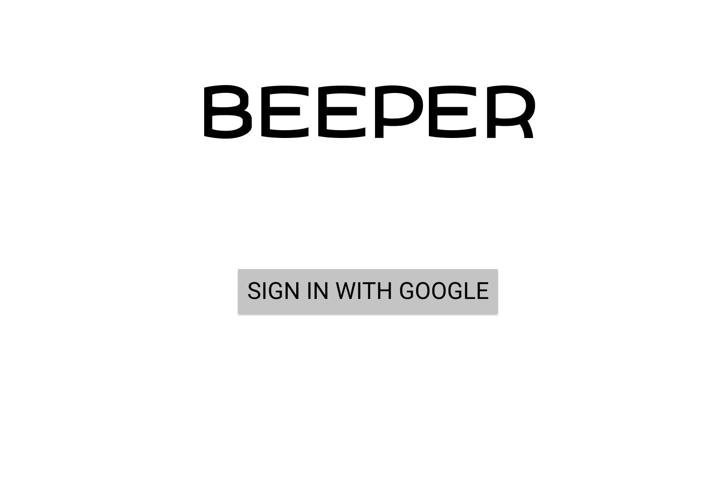
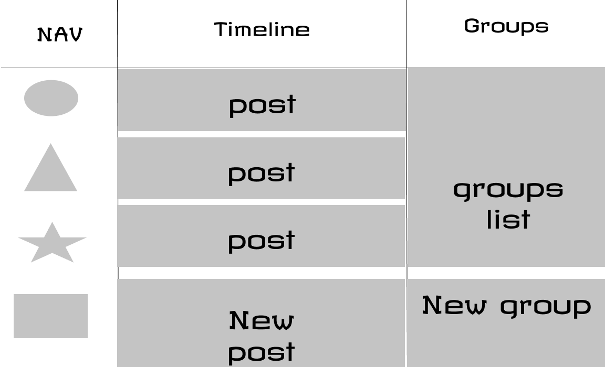
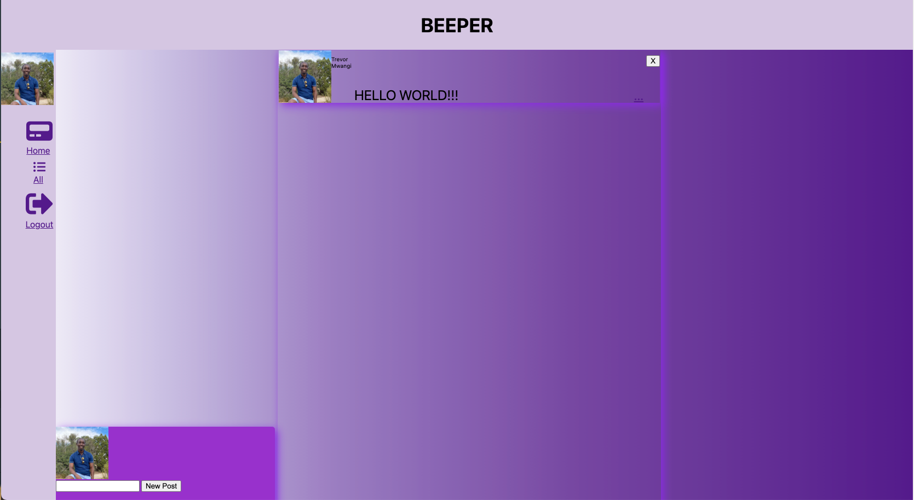

***
 **BEEPER SOCIAL**
***
***
- Social media is a place to connect and communicate with all different kinds of people from all walks of life.
- Beeper is an app that lets you connect with other people and talk about anything and everything.
 ***
**Planning**
***
* I first started out with the idea of creating an app that was similar to twitter.
* Beeper is an app that favors text more than anything so twitter was a great model.
***

[Join the party](https://beeper-social.herokuapp.com/)
***
**Technology Used**
***
* HTML
* CSS
* Javascript
* EJS
* Git
* MongoDB
* Mongoose
* Google OAuth
* Passport
***
**Icebox**
***
* Add ability to add friends
* Add search functionality
* Add dark mode
* Add ability to Create and join groups
* Add an api that posts pictures. 
